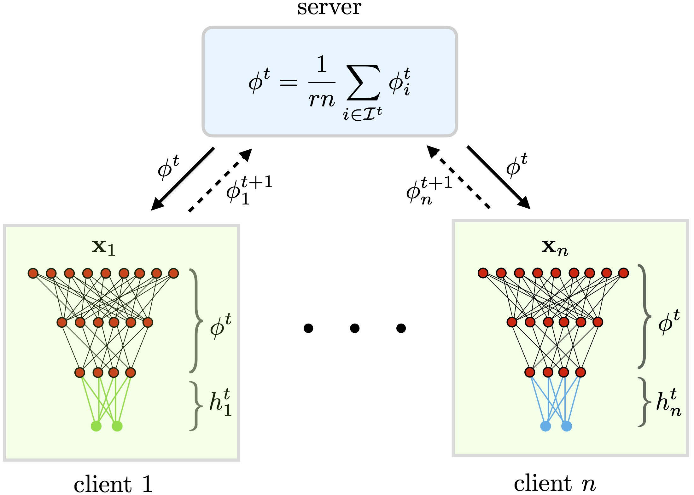

# Exploiting Shared Representations for Personalized Federated Learning (ICML 2021)

Authors: Liam Collins, Hamed Hassani, Aryan Mokhtari, Sanjay Shakkottai

This repository contains the official code for our proposed method, FedRep, and the experiments in our paper [Exploiting Shared Representations for Personalized Federated Learning](https://arxiv.org/pdf/2102.07078.pdf).

*This paper has been accepted at ICML 2021.*

<p>
    
</p>

## Dependencies

The code requires Python >= 3.6 and PyTorch >= 1.2.0. To install the other dependencies: `pip3 install -r requirements.txt`.

## Data

This code uses the CIFAR10, CIFAR100, Federated Extended MNIST (FEMNIST), MNIST, and Sentiment140 (Sent140) datasets.

The CIFAR10, CIFAR100 AND MNIST datasets are downloaded automatically by the torchvision package. 
FEMNIST and Sent140 are provided by the LEAF repository, which should be downloaded from https://github.com/TalwalkarLab/leaf/ and placed in `FedRep/`. 
Then the raw FEMNIST and Sent140 datasets can be downloaded by following the instructions in LEAF. 
In order to generate the versions of these datasets that we use the paper, we use the following commands from within `FedRep/leaf-master/data/sent140/` and `FedRep/leaf-master/data/femnist/`, respectively:

Sent140: `./preprocess.sh -s niid --sf 0.3 -k 50 -tf 0.8 -t sample`

FEMNIST: `./preprocess.sh -s niid --sf 0.5 -k 50 -tf 0.8 -t sample`

For FEMNIST, we re-sample and re-partition the data to increase its heterogeneity. In order to do so, first navigate to `FedRep/`, then execute 

`mv my_sample.py leaf-master/data/femnist/data/`

`cd leaf-master/data/femnist/data/`

`python my_sample.py`

## Usage

FedRep is run using a command of the following form:

`python main_fedrep.py --alg fedrep --dataset [dataset] --num_users [number of users] --model [model] ...`

A full list of configuration parameters and their descriptions are given in `utils/options.py`.
For examples of running FedRep as well as the FL baselines we compare against, please see the executable files in `scripts/`, which recover the results from the paper.

## Citation

Please cite our paper if you use our implementation of FedRep:

```
@article{collins2021exploiting,
  title={Exploiting Shared Representations for Personalized Federated Learning},
  author={Collins, Liam and Hassani, Hamed and Mokhtari, Aryan and Shakkottai, Sanjay},
  journal={arXiv preprint arXiv:2102.07078},
  year={2021}
}
```

# Acknowledgements

Much of the code in this repository was adapted from code in the repository https://github.com/pliang279/LG-FedAvg by Paul Pu Liang et al., which in turn was adapted from https://github.com/shaoxiongji/federated-learning by Shaoxiong Ji. 

